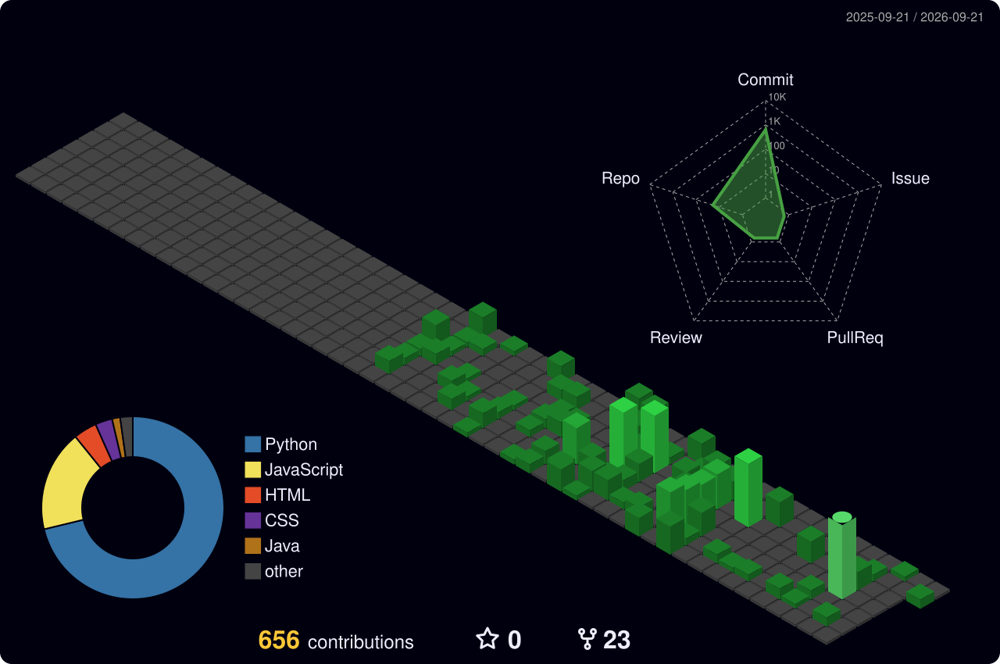

<div align="center">

<h1 align="center">
  Hi👋 I'm Priyan
</h1>


### *"Writing code, breaking things, and learning every day."*

<br/>

[](https://www.linkedin.com/in/priyan-u-621717324)
[](mailto:priyan190406@gmail.com)
[](https://yourportfolio.dev)
[](https://github.com/Priyan-19)
<br/>


</div>

---

## 👋 Introduction


<div align="left">

```python
student = {
    "name":     "Priyan",
    "degree":   "B.Tech-Computer Science and Business Systems",
    "year":     "Final Year (2023–2027)",
    "status":   "Open to internships & collaborations",
    "motto":    "Learn → Build → Break → Repeat 🔁"
}
```
</div>

---

## 🧑‍💻 About Me


<div align="left">
<ul>
<li>🎓 Pursuing my degree in <b>Computer Science and Business Systems</b> at <b>Dr.N.G.P. Institute of Technology</b></li>
<li>🌱 Passionate about <b>web development</b>, <b>problem solving</b>, and <b>cybersecurity<b></li>
<li>🔍 Currently exploring how software and security intersect in the real world</li>
<li>🎯 Goal: Land a solid internship and contribute to open-source projects</li>
</ul>
</div>
<br>


---

## 🛠️ Skills

### 💻 Languages
[]()
[]()
[]()
[]()
[]()

### 🧰 Tools & Frameworks
[]()
[]()
[]()
[]()
[]()
[]()
[]()
<br>
[]()
[]()
[]()
[]()
[]()
[]()
[]()


### 🎭 Creative & Practices 
[]()
[]()
[]()
[](https://tryhackme.com/p/priyan190406)
[](https://app.hackthebox.com/users/2511839)
[](https://leetcode.com/u/Priyan19)

---

## 📊 LeetCode Stats
<div align="center">

<a href="https://leetcode.com/u/Priyan-19"></a>

</div>

---

## 📊 GitHub Stats


<div align="center">
<a href="https://github.com/Priyan-19"></a>
<br><br>
<a href="https://github.com/Priyan-19"></a>
<br><br>
<!-- LOC-STATS:START -->

<!-- LOC-STATS:END -->
</div>

---

## 📬 Contact Me


<div align="center">

I'm always open to connecting with fellow students, developers, or mentors!


[](mailto:priyan190406@gmail.com)
[](https://www.linkedin.com/in/priyan-u-621717324)
[](https://yourportfolio.dev)
[](https://github.com/Priyan-19)


---

<div align="center">

*Thanks for stopping by! Drop a ⭐ on any project that interests you — it genuinely means a lot.*

</div>
